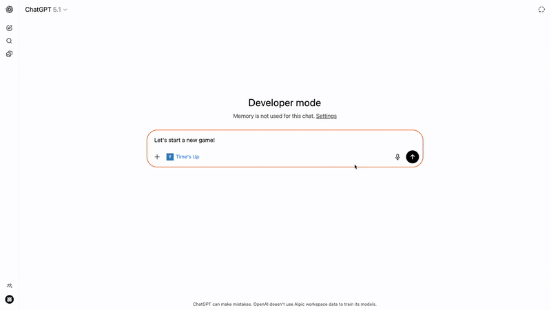

# 🎯 Time's Up — ChatGPT Edition

A party word-guessing game where **you** give hints and **ChatGPT** tries to guess the secret word. Built as a native ChatGPT App with interactive widgets.



## How to Play

1. **Connect to the game** — Add a new connector in ChatGPT with the URL https://times-up.alpic.live
2. **Start the game** — Add the connector to a new conversation and say "Let's play!"
3. **Give hints** — Describe the word without saying it directly
4. **Watch ChatGPT guess** — It'll try to figure out the word from your clues
5. **Celebrate or continue** — When it gets it right, draw another card!

> 🌍 **Multilingual support**: Cards are available in English, French, Italian, Portuguese, and Spanish — the game automatically adapts to your ChatGPT language settings.

## Getting Started

### Prerequisites

- Node.js 22+
- pnpm (`npm install -g pnpm`)
- Ngrok (for local development)

### Installation

```bash
git clone https://github.com/fredericbarthelet/advent-chatgpt-app.git
cd advent-chatgpt-app
pnpm install
```

### Development

```bash
pnpm dev
```

This starts the server on port 3000 with:

- **MCP endpoint** at `/mcp` — the ChatGPT App backend
- **React widgets** with Vite HMR — see changes instantly in ChatGPT

### Connect to ChatGPT

1. Expose your local server:

   ```bash
   ngrok http 3000
   ```

2. In ChatGPT:
   - Go to **Settings → Connectors → Advanced** and enable **Developer mode**
   - Navigate to **Settings → Connectors → Create**
   - Enter your ngrok URL with `/mcp` path (e.g., `https://abc123.ngrok-free.app/mcp`)

3. Start a new conversation, add your connector via **+ → Your connector**, and say "Let's play!"

### Chrome Network Access Note

> ⚠️ Since Chrome 142, local network access from websites is blocked by default. Widgets in iframes won't appear without this fix.
>
> Go to `chrome://flags/#local-network-access-check` and **disable** Local Network Access Checks.

## Deploy to Production

Deploy your Time's Up game with Alpic:

[](https://app.alpic.ai/new/clone?repositoryUrl=https%3A%2F%2Fgithub.com%2Ffredericbarthelet%2Fadvent-chatgpt-app)

Then add your deployed URL to ChatGPT connectors.

## Project Structure

```
├── server/
│   ├── src/
│   │   ├── server.ts      # MCP server with game tools (play, guess)
│   │   ├── cards.ts       # Card drawing logic
│   │   └── cards.json     # 100+ word cards in 5 languages
│   └── index.ts           # Express server
└── web/
    └── src/
        └── widgets/
            ├── play.tsx   # Interactive card widget
            └── locales/   # UI translations
```

## How It Works

This app uses the [OpenAI Apps SDK](https://developers.openai.com/apps-sdk) to create an MCP-compatible server that:

1. **Exposes a `play` widget tool** — Draws a random card and renders it as an interactive widget that only the user sees
2. **Exposes a `guess` tool** — Lets ChatGPT submit guesses that are validated against the secret word
3. **Renders React widgets** — The card UI is a React component displayed natively within ChatGPT

The magic is that ChatGPT never sees the secret word — it only receives confirmation when it guesses correctly!

## Resources

- [OpenAI Apps SDK Documentation](https://developers.openai.com/apps-sdk)
- [Model Context Protocol (MCP)](https://modelcontextprotocol.io/)
- [Alpic Documentation](https://docs.alpic.ai/)

---

Made with ❤️ for the ChatGPT Advent Calendar 2025
