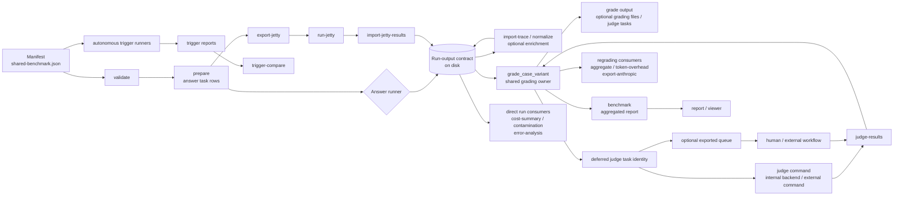
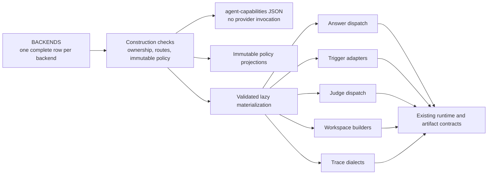
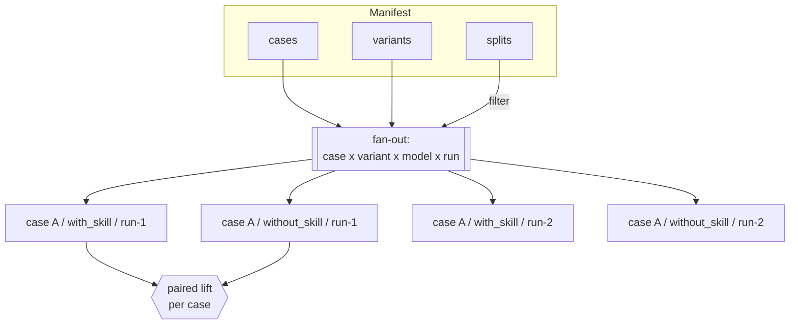
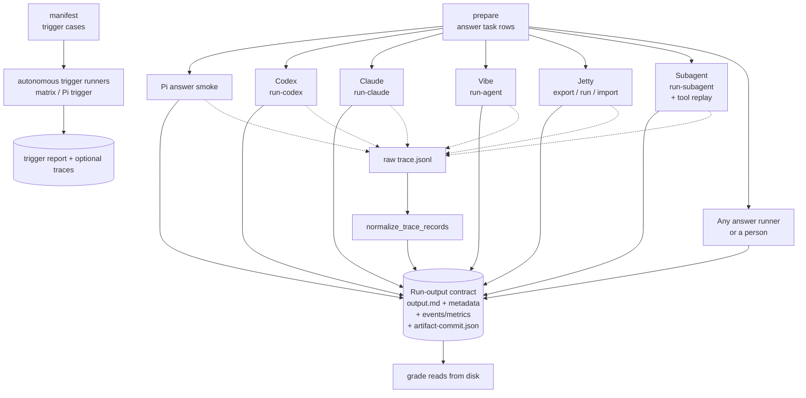
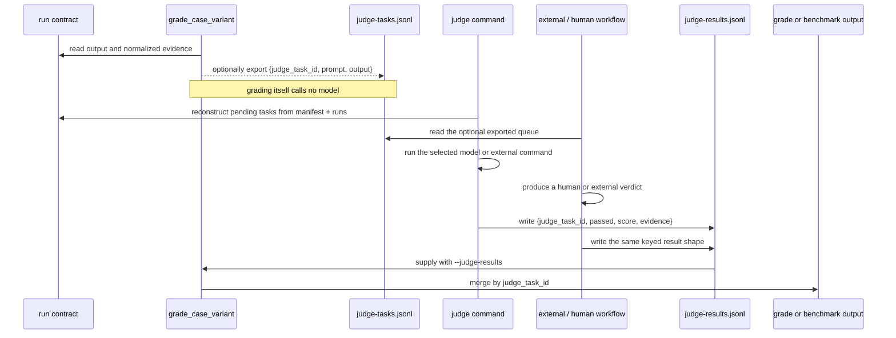

# Architecture

The harness scores whether a skill changes a model's output. At minimum it runs the same
case in a paired `with_skill` / `without_skill` experiment, then grades both runs with checks
that call no model by default. Repetitions, model sweeps, and ablation arms extend that experiment
without changing the paired comparison at its centre. Everything in the system follows
from that decision.

This doc shows how the pieces fit. For what each piece *is*, read
[`abstractions.md`](abstractions.md).

## The pipeline

The pipeline is an artifact graph, not one long process. A manifest branches into answer
tasks, autonomous-trigger work, and static checks. Commands can run on different machines or
days apart, and several commands call the same grading owner directly rather than
consume another command's report.

Every `skill-benchmark` entrypoint crosses one typed boundary before entering this graph.
`argparse.Namespace` is parsed into a frozen `ValidatedLegacyCLIInvocation`: the command is a closed
`CLICommand`, paths are `Path` values, and split, variant, model, and numeric domains are
validated once. Dispatch then proves that every parser command has exactly one handler owner.
Established handlers still receive a freshly thawed Namespace through one explicit compatibility
adapter; typed projections migrate handler by handler rather than being silently discarded.



`grade` and `benchmark` are peer frontends over `grade_case_variant`: `benchmark` does not
read the output of the `grade` command. `token-overhead`, `export-anthropic`, `aggregate`,
and run-aware audit paths also reuse grading or benchmark construction directly. An optional
`grading.json` or `grade --out` report is therefore a review/export artifact, not a required
handoff to `benchmark`.

The default grading path and report construction are local and model-free. A `script`
assertion with `--allow-scripts` or embedding assertion with `--embed-cmd` is an explicit,
opt-in external oracle subprocess; the harness does not choose what that command runs.
Model calls otherwise live in explicit answer and trigger runners, the opt-in `judge` /
`judge-robustness` paths, and `suggest-cases --generate-cmd`. A blind comparison can also be
judged by a human or model outside the harness before `compare-results` imports the decisions.
Jetty adds a networked control plane around a remote answer runner; import and default grading
remain local.

Provider support is declared once in `agent_capabilities.BACKENDS`. The answer,
trigger, and judge implementations remain separate protocol implementations,
while executable answer entrypoints, command choices, provider-specific command
flags, capability gates, smoke targets, workspace builders, and failure policy
project from the same row. Run `skill-benchmark agent-capabilities` to inspect
that control plane as JSON. An explicit answer route distinguishes native dispatch
from Jetty export/import and the dedicated subagent path. Implementation dispatch
maps are mutable replacement views for compatibility; policy projections are
deeply immutable, and neither is an alternative registration point for new providers.
Construction validates the row's ownership, routes, closed scalar vocabularies,
and nested declaration shapes. Lazy materialization then validates the resolved
answer, trigger, judge, workspace, and trace runtime contracts before publishing
their compatibility views.



## Four axes, one grid

A case does not run once. It runs across a grid of variants, models, and repeats, filtered by split.
`prepared_task_rows` builds this grid. The variant axis is where lift lives, because lift is
the difference between two arms of the same case.



Variants stay orthogonal to cases. A case knows nothing about which arm will run it, and an
arm applies to every case, so adding a `with_skill`/`without_skill` pair never edits case
text. The model sweep (`prepare --models a,b,c`) adds a third axis the same way: a new
dimension in the fan-out (`case × variant × model × run`), not a new kind of variant. The
report then groups `by_model` and computes lift per (case, model) — see `model_analysis`.

Before any lift, reliability, cost delta, or token-overhead value is computed, result rows become
`ExperimentalPairKey(case, model, repetition, population)` arms under an explicit binary
`ContrastSpec`. Only a validated pair with exactly one declared treatment and control arm can
contribute. The default contrast preserves `with_skill`/`without_skill`; its canonical factor
coordinates keep activation, skill-set, and content-revision axes distinct for future contrasts.
Missing/ineligible arms remain blocked
diagnostics with their `contrast_id`; a comparison result is identified by `(contrast_id, pair_key)`,
and duplicate identities fail instead of overwriting an earlier row. Telemetry then
adds its stricter provenance/unit/billing-basis comparison.

## Typed trust boundaries

The on-disk formats stay JSON for interoperability, but JSON dictionaries do not flow freely through
the interior. Each external boundary has one parser and a closed value:

```text
prepared row -> PreparedTaskDraft -> PreparedTask
provider result -> Completed | TimedOut | SpawnFailed | ProviderFailed
run evidence -> process × provider-response × trace × artifact-set state
artifact set -> Legacy | MissingCommit | InvalidCommit | Incomplete | Complete
event log -> Missing | Invalid | Loaded
assertion result -> Satisfied | Failed | Unavailable | Skipped
report coverage -> Empty | Complete | Partial
qualitative work -> JudgeTask
judge process -> JudgeInvocation
judge row -> Boolean | Scored | Dimension | Dynamic | Consensus verdict
trace status -> Completed | InProgress | Failed | Unknown
Jetty status -> Queued | Running | Succeeded | Failed | TimedOut | ProtocolInvalid
result arms -> ExperimentalPair | BlockedExperimentalPair
```

Booleans such as execution success, verdict pass, Jetty success, and comparability are derived from
those variants. `ObservationEvidence` keeps process exit, provider response, trace, and artifact-set
state independent (`complete | incomplete | unknown`); full-run operation evidence requires the
first three to be complete. A zero-exit protocol failure therefore preserves return code zero while
remaining unscorable, and a valid answer with no trace can carry provider usage/cost without
claiming zero commands. When a persisted row is read back, its parser re-establishes the invariant
rather than trusting fields that happened to serialize together. The detailed inventory and residual risks
are in [`correctness-by-construction-audit.md`](correctness-by-construction-audit.md).

## The runner boundary

Runners disagree about everything except one thing: they all leave the same files on disk.
That agreement is the contract, and it is why a new runner needs no change to grading.



Each runner emits its own event shape. `normalize_trace_records` collapses those shapes into
one schema-versioned `events.json` and `metrics.json` so a process assertion like
`command_order` reads the same fields no matter who produced the run. Lifecycle status is parsed
into a closed event state first; only completed operations count as commands, tools, reads, writes,
or skill invocation. Caller extras cannot overwrite the derived evidence fields. New runner and
Jetty artifact sets write `artifact-commit.json` last with the required-file inventory and SHA-256
digests; readers classify a missing or stale marker as an incomplete artifact set. When evidence is
missing or unknown, the assertion fails rather than guessing from the answer text.

## How a judge defers

A qualitative check does not call a model inside `grade_case_variant`: without a matching
verdict, grading constructs a judge task and moves on. `grade --judge-tasks` can export those
tasks for an external or human workflow. The `judge` command does not consume that optional
queue; it reconstructs the same tasks from the manifest and run artifacts, invokes the
selected backend, and writes keyed judge results. Supplying those results to `grade` or
`benchmark` merges each verdict, stamped with its `judge_model`, into the corresponding row.



The key is the `judge_task_id` (`case::variant::run-n::assertion`, gaining a `model` segment on
a multi-model run so verdicts cannot collide across models). It lets results arrive out of
band, from any model or human, and still land on the right assertion. Stored verdicts are parsed
into strict boolean/scored/dimension/dynamic/consensus variants; duplicate IDs and contradictory
score/threshold/pass fields are rejected. Every task and result also carries
`judge_input_sha256`, a digest of the exact rendered judge input; a matching task ID with stale
prompt, evidence, or candidate output is rejected rather than silently reused. Deterministic
checks run first; the judge handles only what a keyword or regex cannot.

## Where grading stays honest

Three properties hold across the whole pipeline, and every feature — the roadmap included — is
built to preserve them:

- **Default grading is local and deterministic.** `grade_case_variant` reads files and applies
  in-process checks. No network, no model. A re-grade after editing an assertion costs nothing.
  The explicit `--allow-scripts` and `--embed-cmd` oracle modes may invoke a caller-supplied
  subprocess. A test guard
  (`test_confidence_floor.py`) patches `subprocess`/`urllib` to raise and proves the grade path
  completes without either when those modes are disabled.
- **The harness picks no model.** Judge and runner models are yours to supply. The tool scores
  outputs; it does not decide who produces them.
- **Generation is answer-key-safe.** `prepare` omits expected behavior and rubrics unless you
  ask for them, so the model under test cannot read its own answer key.

Each assertion carries a **severity** (`critical`/`gate`/`soft`), so pass/fail is not flat: a
`critical` failure vetoes the run and is excluded from every mean, a `gate` carries the pass
rate, and a `soft` result feeds only the per-run graded score — never a pass rate. That split
is threaded through every report view, which is what lets graded scores measure *how much
better* without a soft miss quietly moving the headline number.

Runs also carry **cost telemetry** on the same file contract: each `metadata.json`/`metrics.json`
holds normalized `usage_normalized`/`cost_normalized` blocks (missing is marked, never zero),
and the benchmark report aggregates them into a `cost_summary` ledger — operational spend kept
beside the quality signal, never mixed into it. `suite-run` projects that spend before any
model call and can gate on a budget.

A feature that needs a model (embedding similarity, generating harder cases) lives behind an
opt-in flag or an external command, the way `script` assertions already do. That placement is
not a detail; it is what keeps a passing benchmark trustworthy.
